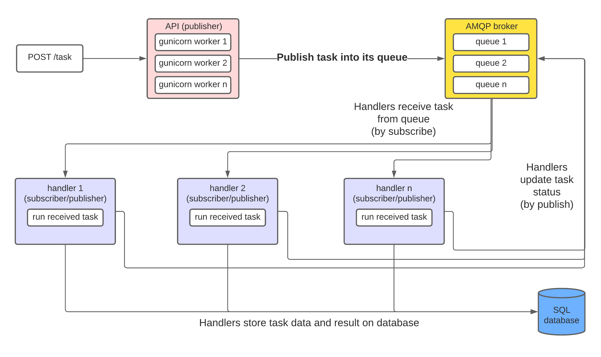

``pytasks`` is a complete and customizable microservice for running computational tasks on remote machines and viewing its results through an API. 

:warning: **Notice**: the documentation for this project is still being written. You may encounter uncomplete pages or sections.

## Current development

The project is currently on **release 3**.

You can view the [source code]() and contribute by creating a pull request with your modifications or opening an [issue]().


## Getting started

The microservice has two instances, an ``api`` exposed on the web, where users can send task requests to a queue, and a ``handler``, which listens to the queue and execute the tasks.

To run ``pytasks`` with all of its dependencies in a testing environment, ensure you have [docker](https://docs.docker.com/engine/install/) and [docker compose](https://docs.docker.com/compose/install/) installed and then run the following command:

```bash
git clone https://github.com/brenopelegrin/pytasks.git &&
cd pytasks &&
export JWT_PRIVATE_PEM=$(cat ./examples/keys/jwtRS256.key) &&
export JWT_PUBLIC_PEM=$(cat ./examples/keys/jwtRS256.key.pub) &&
docker compose up -d
```

> :warning: This command uses the example RSA keypair stored in the repository and default passwords for PostgreSQL and RabbitMQ. You **MUST** setup your own RSA keypair and credentials in production to avoid security issues. See the [Setting up](setup.md) section for more informations.

After the containers start, the API will be available at ``http://localhost:8080``.

:light_bulb: For more instructions on how to customize your ``pytasks`` containers and how to run them, see [Setting up](setup.md).

## Understanding the project with more depth

### **Overview**

The project's main goal is to make cloud computing more accessible and facilitate its implementation.

``pytasks`` provides a complete and customizable backend so that developers only have to worry about developing the tasks, not the backend that runs them.

It is based on solid and robust technologies, packages and frameworks. The API is built with [Flask](https://github.com/pallets/flask) and served with [gunicorn](https://github.com/benoitc/gunicorn). The handler is built on top of [Celery](https://github.com/celery/celery), enabling it to use various backends for the queue, such as [Redis](https://redis.io/) and [RabbitMQ](https://www.rabbitmq.com/) and various database backends for storing task results, such as [PostgreSQL](https://www.postgresql.org/).

#### Overview fluxogram of pytasks


### **What exactly is a task?**

Tasks are coded functions that receives arguments and return results, obbeying **some specifications**. They can be put together in packages (which we call **taskpacks**) and automatically installed and imported on deploy.
The tasks need to have defined arguments with declared types, and the results should be serializable in JSON. 

For example, the following function can be considered as a task:

```python
@celery_app.task
def mySimpleTask(number1: int, number2: int):
    addition = number1 + number2
    multiplication = number1 * number2
    return(
        {
            "addition": addition,
            "multiplication": multiplication
        }
    )
```

### **A little more about the [api](api.md)**
The API 

Quick list of endpoints

| Endpoint                | Method   | Description                                        |
| ----------------------- | -------- | -------------------------------------------------- |
| ``/task/<taskId:uuid>`` | ``GET``  | Fetch task information                             |
| ``/task``               | ``POST`` | Post a task to server                              |
| ``/protected``          | ``GET``  | Fetch available protected tasks for your JWT token |
| ``/token``              | ``GET``  | Generate JWT token from credentials                |

:light_bulb: For more detailed information on API endpoints and how to make requests, please see the [API specification](api.specification.md) section.

### **A little more about the [handler](handler.md)**
The Handler

